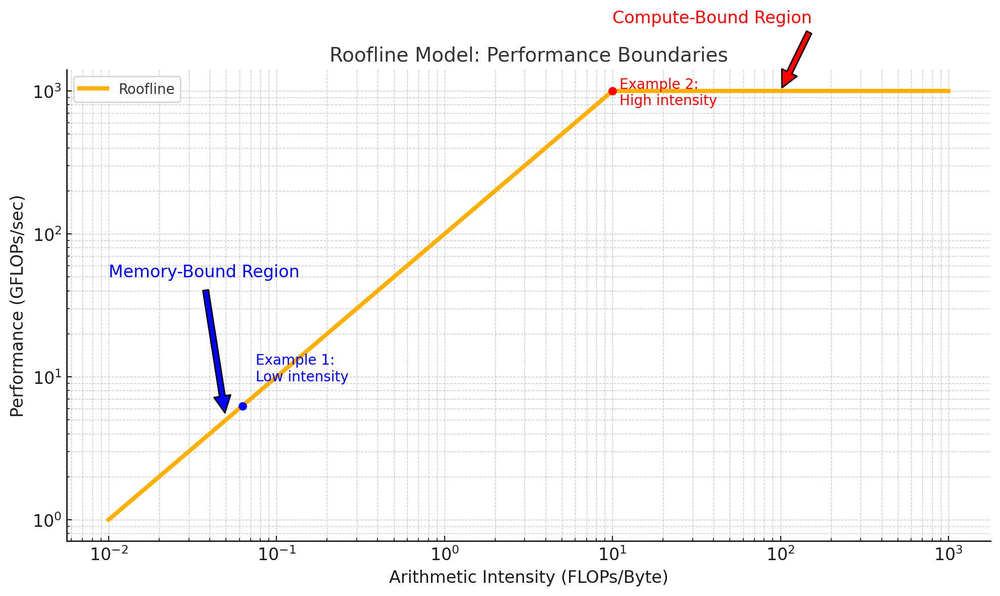

# Roofline Model introduction

### Understanding the Roofline Model

https://dando18.github.io/posts/2020/04/02/roofline-model

There are 2 big takeaways from this model.

1. No matter how fast your processing unit is, whether CPU or GPU, if your algorithm is waiting on data to load all the time, then your performance will be limited by memory speed and not the processor speed.
2. On the other end if your algorithm does not use that many load/stores, i.e. it is memory efficient, you still cannot achieve better performance than the processor is capable no matter how high the arithmetic intensity.


要通过 **Roofline model 的坐标图** 来理解你提出的这两点，可以从图中的两个核心维度入手：

- **X 轴：Arithmetic Intensity（运算强度）**，单位为 FLOPs/byte，表示每加载/存储1字节内存数据能做多少次计算。
- **Y 轴：Performance（性能）**，单位为 FLOPs/sec，表示每秒实际完成的计算量。

Roofline 模型展示了一个系统在不同运算强度下理论上能达到的最大性能上限，它由两段组成：

1. **内存带宽限制段（memory-bound）：线性斜率部分**
   $$
   \text{Performance} = \text{Arithmetic Intensity} \times \text{Memory Bandwidth}
   $$

2. **计算性能上限段（compute-bound）：水平线部分**

   - 代表处理器理论上限计算性能，比如峰值 FLOPs。

### **📌 对应你说的两点，结合 Roofline 图分析：**


### **第一点：受内存带宽限制**

> “不管 CPU/GPU 多快，如果算法总是在等待数据加载，那么性能会受限于内存带宽。”

**解释：**

- 在 Roofline 图中，左边区域是 **memory-bound 区域**（斜线部分）。
- 如果一个算法的 Arithmetic Intensity 很低（在图的左边），那么它位于内存带宽线的下方，性能瓶颈是内存系统，而不是计算单元。
- 即使计算资源再强（图上的水平线再高），也无法突破带宽线。

**代码举例**

```c++
for (int i = 0; i < N; i++) {
    y[i] = a[i] + b[i]; // 每次加载两个值，做一次加法，强度低
}
```

- 运算强度约为 1 \text{ FLOP} / 16 \text{ Byte}，非常低。
- 性能受限于内存带宽。


### **第二点：受计算上限限制**

> “如果算法非常 memory-efficient，也不能超过处理器的计算上限。”

**解释：**

- 在图的右边，Arithmetic Intensity 很高时，Roofline 曲线达到水平线，进入 **compute-bound 区域**。
- 此时性能不再由内存限制，而是受限于 CPU/GPU 的计算能力。
- 再增加运算强度也不能超过峰值 FLOPs/sec。

```c++
for (int i = 0; i < N; i++) {
    y[i] = a[i] * x + b[i] * z + c[i] * w + d[i] * u; // 多重计算，少量访问
}
```

- 运算强度高，可能达到 4~8 FLOPs/byte。
- 进入 compute-bound 区域，受限于 CPU 的峰值能力。

### **✅ 总结表：**

| **算法行为**   | **Roofline区域** | **性能瓶颈** | **性能提升方式**     |
| -------------- | ---------------- | ------------ | -------------------- |
| 运算少、访存多 | Memory-bound     | 内存带宽     | 增加重用、减少访存   |
| 运算多、访存少 | Compute-bound    | 处理器算力   | 更快的核、更并行架构 |

### 示意图：

这张图清楚地展示了你提到的两点：


- **蓝色点（Example 1）**：运算强度低（0.0625 FLOPs/Byte），在 **memory-bound 区域**，性能受限于内存带宽，即使处理器更强也无法提高性能。
- **红色点（Example 2）**：运算强度高（10 FLOPs/Byte），在 **compute-bound 区域**，性能接近或达到处理器的峰值算力，再提高运算强度也无法进一步提升性能。